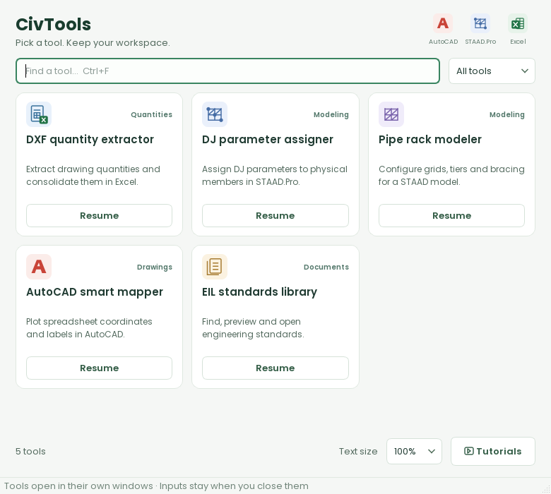

# CivTools

A Windows engineering workspace built with **PySide6 / Qt 6**. Five tools share
a compact launcher, independent utility windows, consistent controls and bundled
Poppins typography. The desktop no longer depends on Tkinter.

The launcher and utility windows use a shared set of original vector icons:
AutoCAD-style red drawing marks, distinct STAAD modeling marks, Excel/workbook
icons and document-library icons. Each tool has a small engineering workflow
illustration in its header. These visuals are drawn and cached in Qt at high-DPI
resolution; they do not load the older raster illustrations or require downloads.



## Run

Python 3.10 or newer, on Windows:

```powershell
python -m venv .venv
.\.venv\Scripts\python.exe -m pip install -r requirements.txt
.\.venv\Scripts\python.exe CivTools.py
```

AutoCAD and STAAD.Pro must be installed for the corresponding CAD operations.
Open the intended AutoCAD drawing or STAAD model before running a job. Pipe rack
generation requires a blank model. Pipe rack generation and AutoCAD plotting modify
the active CAD model; the parameter generator scans STAAD and creates a command
preview for review and export. The geometry preview is a modeling aid, not a
structural design check.

## Tools

- **DXF quantity extractor:** extract Approximate Quantities tables from model and
  paper space; preserve other drawings, track changes and consolidate material
  totals. Select an `.xlsx` or `.xlsm` mapping workbook, then choose an output
  workbook. Consolidation requires `Drawing_Structure_Mapping`. Work is staged in
  a temporary copy and committed only after success; VBA is preserved for `.xlsm`.
- **STAAD parameter generator:** configure concrete and steel design parameters,
  scan the active STAAD model, and generate editable command previews. Search
  parameters, save or load JSON presets, validate commands and export the preview.
- **Pipe rack modeler:** comma-separated grid positions and tier elevations,
  live geometry preview, support selection, bracing and saved configurations.
- **AutoCAD smart mapper:** choose a worksheet (the first is selected by default), with a header row followed
  by center X, center Y, width, height and optional label in columns A–E. Text
  height and offset use drawing units. A sample table and valid/invalid/blank counts
  use the same validation as plotting. Labels and geometry failures are reported separately.
- **EIL standards library:** select a local PDF folder; search and sort the table,
  inspect details, preview the first page and open the original document.

CAD calls run on a dedicated serial queue with COM-initialized workers, separate
from workbook and library workers. The active target, stages, percentage and elapsed
time appear alongside the job. Other tools remain usable during a job. Exiting the suite
is blocked while an engineering operation is running; there is no unsafe mid-job
cancellation of CAD changes. Errors and bounded activity logs appear inline.
The document browser has a metadata cache, a 12-image preview cache and only one
active preview render, with the latest selection queued. All PDF scanning and rendering
run in one isolated process. Previews render only when the Preview option is enabled.

Pipe rack tier elevations are **absolute**, including when the base is nonzero.
The preview and generator share the same geometry plan. Invalid inputs disable generation,
and the form shows node/beam estimates before connecting. Generation requires an open,
saved, empty STAAD model and checks its node/member counts before any changes. Models are
limited to 10,000 nodes and 30,000 beams. CAD failures may leave partial changes, which are
reported explicitly; inspect the active model before retrying.

## Navigation and data

The launcher opens at 780 × 700 with illustrated tool cards in a responsive grid.
Cards reflow from three columns to two in narrower windows, and search results
close gaps automatically. Each tool opens in its own resizable window, so you can use several
tools beside your CAD application and minimize the launcher independently.
**Keep on top** pins an individual tool. Closing a utility hides it and preserves
its inputs for **Resume**; an active job continues and its status appears in the
launcher. Exit through the launcher after jobs finish to close the entire suite.
Window geometry, form inputs, file-dialog folders, library location and preview preferences
also survive restarting the app. Text size can be set to 100%, 115% or 130% in the launcher.
Completed workbook jobs offer Open workbook and Show in folder; subsequent consolidation
uses the newly generated workbook.

`Ctrl+F` focuses search, `Escape` clears search and `Alt+Home` in a tool opens the
launcher. Previews and saved pipe rack configurations are optional expandable
sections. Drop DXF drawings onto the quantity extractor, or drop an Excel workbook
onto a workbook field. Select drawings to remove individual files from a batch.
Extraction and consolidation buttons become available when their required inputs
are selected.
Set `CIVTOOLS_TUTORIALS_PATH` to your local tutorial folder for the tutorials button.

Provision standards in `data/EIL STD/` beside the source entry point or executable,
or choose a different folder in the library. Engineering datasets are not bundled.
Settings, pipe rack configurations and PDF metadata are stored in
`%APPDATA%/CivTools/`. Legacy DJ settings in the source directory are read as a
fallback. The app does not log startup usage or send engineering data externally.
For portable/testing setups, `CIVTOOLS_CONFIG_DIR` overrides the settings directory.

## Build

```powershell
.\.venv\Scripts\pyinstaller.exe CivTools.spec
```

Distribute the **entire** `dist/CivTools/` directory and run `CivTools.exe` within
it. The directory build avoids decompressing the Qt runtime at each startup. UPX
is disabled. Fonts and their SIL Open Font License are included in the build.

## Verification

```powershell
.\.venv\Scripts\python.exe -m unittest discover -s tests -v
```

The tests cover engineering geometry, actual Open/Resume button clicks, responsive
card layout, Qt page construction and state preservation,
search, worker delivery on the UI thread, failure recovery, grid validation,
transactional workbook output, unchanged drawing preservation, consolidated totals
and PDF cache invalidation. Qt tests run with the offscreen platform. Actual CAD
integration still requires validation with installed AutoCAD/STAAD and real models.
`CivTools.exe --smoke-test` opens all five tools offscreen and checks real rendering
in the isolated PDF process. Set `CIVTOOLS_SMOKE_REPORT` to save its JSON result.
Windows must permit local child processes for PDF tests and previews.

After building, run `.\.venv\Scripts\python.exe scripts/verify_release.py` to check
both source and packaged startup, including a real PDF render. Run
`.\.venv\Scripts\python.exe scripts/package_release.py` to create the verified
`dist/CivTools-Windows.zip` archive and its SHA-256 checksum. Local geometry and
worksheet timings can be recorded with `scripts/benchmark.py`; these do not
measure live CAD performance.

## Source layout

`src/civtools/qt_app.py` owns the launcher and utility windows; `qt_pages.py` implements
tool workflows; `qt_style.py` and `qt_widgets.py` define shared visuals;
`qt_artwork.py` draws the integration marks, illustrations and action icons;
`jobs.py` owns background jobs and file operations; `core/` contains UI-independent
engineering algorithms. The previous module paths expose compatibility imports
for the extracted services and pipe rack generator.
